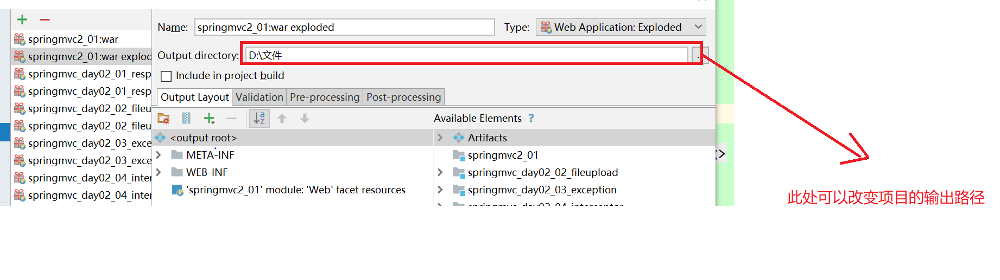

# 框架debug

##Question1

### 页面闪跳

**现象**：今晚将本地仓库代码删除，然后重新从远程仓库克隆代码到本地，启动idea后在下方边框一直提示：Updating Indices 和 进度条，页面不停的闪烁。

**解决方法**：进入idea的File——>Invalidate Caches / Restart——>Invalidate and Restart

------

## Question2

### java文件上传路径

## Question3

- 如果以war工程运行，文件上传的目录在  D:\dev\apache-tomcat-8.5.31\webapps\ROOT\uploads\

- 可以看出在tomcat的目录下

- 如果以war-exploded运行，上传目录在    D:\IdeaProjects\springmvc2_01\target\uploads\

- 在项目目录的target下

- target下保存的是webapp下的所有文件

  

- 复制Pom文件里的内容，注意命名要修改，否则运行的路径会错误

- 一般我们文件上传都是用war-exploded运行

- 在一切都正常的情况下看上图的输出路径

- 导入一个项目，必须有artifacts文件，可以根据包自己创建，一般默认创建好了，接着就是配置tomcat，添加artifacts

- 如果以war工程运行，文件上传的目录在  D:\dev\apache-tomcat-8.5.31\webapps\ROOT\uploads\

- 可以看出在tomcat的目录下

- 如果以war-exploded运行，上传目录在    D:\IdeaProjects\springmvc2_01\target\uploads\

- 在项目目录的target下

- target下保存的是webapp下的所有文件

  

- 复制Pom文件里的内容，注意命名要修改，否则运行的路径会错误

- 一般我们文件上传都是用war-exploded运行

- 在一切都正常的情况下看上图的输出路径

- 导入一个项目，必须有artifacts文件，可以根据包自己创建，一般默认创建好了，接着就是配置tomcat，添加artifacts