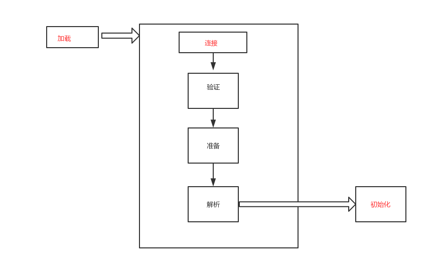
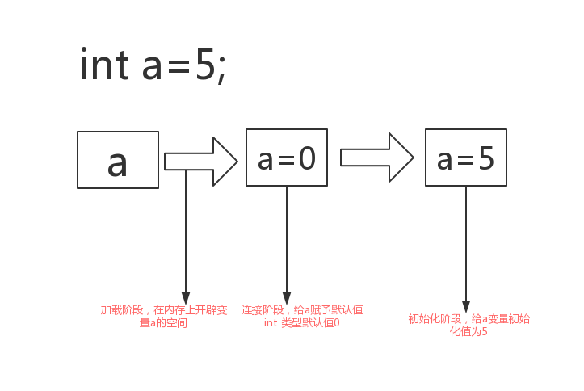
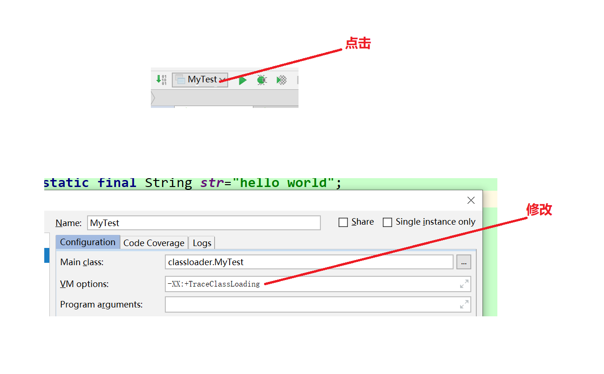

#JVM

## **学习方法**

- 学习最重要的不是输入，而是学会如何输出
- 最好的记忆是在不断的重复和学以致用JVM

## **JVM介绍**

1. 不同于其他应用框架，它是运行编译好的class字节码文件
2. 字节码文件可以人为的反编译为人能看懂的程序语言 运行在虚拟机上的语言最流行的是JAVA语言
3. JVM运行字节码文件通过系统执行指令，从而程序运行

## **类加载**

## **概念**

- 所谓类加载指的是类型的加载，连接和初始化的过程，这些都是在程序运行过程期间完成的
- 所谓类型普遍指Class,Iterface，枚举等，类型不涉及对象
- 类加载过程是在创建对象之前完成的
- 运行期间类的加载分为2部分，一类是**JDK提供**的类，另一类是通过**动态代理反射**生成的，后者提供了开发人员开发程序功能更多的可能

## **应用场景**

- 将编译好的Class字节码文件，从磁盘上面加载到JVM管理的内存里面------**加载**
- 将类与类之间的关系给确定好，并且对字节码进行相关处理，验证和校验都是在连接阶段完成
- 字节码可以人为操纵，反编译，校验后，典型的类与类的调用关系是类之间的符号引用转换成直接引用------**连接**
- 所谓初始化就是对类型里的静态变量进行赋值------**初始化**
- 每一个类都是由类加载器加载到内存当中

## **JVM终止**

- 导致虚拟机终止有很多情况，有正常，异常，系统错误，指令，虚拟机本身就是一个进程

- 1. 正常程序执行结束
  2. 程序遇到异常，此异常抛到main方法，进程终止
  3. 执行 system.exit( )方法指令
  4. 操作系统错误引起程序终止

## 类加载步骤

### **类加载流程图**



- 验证：查找并加载类的二进制数据
- 连接：
  - 验证：确保类被加载类的正确性
  - 准备：为类的静态变量分配内存，并将其初始化为默认值（int默认值为0，布尔是false,引用是null）
  - 解析：把类中的符号引用转换成直接引用
- 初始化：给类的静态变量赋予正确的初始值
- 

### 加载

在准备阶段，先赋默认值，类在内存中的赋值顺序

**加载方式**：

1. 加载点class文件的方式
2. 从本地系统种直接加载
3. 通过网络下载点class文件
4. 从zip,jar等归档文件加载点class文件
5. 从专有数据库提取class文件
6. 将java源文件动态编译为点class文件

#### 类的特点

- 类的加载指的是将类的点class文件种的二进制数据读入到内存中，将其放在运行时数据区的方法区内，然后在内存中创建一个java.lang.class对象用来封装类在方法区的数据结构
- 一个类不管生成多少实例，所以实例对应的class对象只有唯一的一份.class文件
- class对象是一面镜子，能调析到你class文件里面的所有内容，所有结构
- class文件并未指定一定要放在哪里，故加载方式多样 ，绝大多数位于磁盘上，位于classpath下类路径下面，从磁盘上面加载


#### 类的生成

java是源文件，由程序员编写，.class是字解码文件由虚拟机编译.java生成

在动态代理中出现，类是在运行期间生成的，编译的时候不存在

**JSP**本身是一个点class结尾的后缀名命名的文件，JSP里可以放html代码，java代码，最终JSP转换成一个Servlet，Servlet是一个class,java类，所以会被编译成class文件，被虚拟机加载，WEB开发应用JSP应用文件

#### 符号引用

##### **间接引用**

一个类中的方法引用另外一个类

##### **直接引用**

指针指向对象的内存位置，找到特定方法

### 类的使用和卸载

#### **使用**

创建对象和调用对象

##### Java程序对类的使用方式

- 主动使用
- 被动使用

所有的Java虚拟机实现每个类或接口

必须在java程序**首次主动使用**时才初始化他们，以后不会再初始化

###### **主动使用七种方式**

1. 创建类的实例
2. 访问某个类或接口的静态变量，或者对其赋值
3. 调用类的静态方法
4. 反射（如   class.forName("包名+类名")）
5. 初始化一个类的子类
6. Java虚拟机启动时被表明为启动类（包含main方法的类)
7. java 1.7提供动态语言的支持，invoke.MethodHandle

**初始化一个类的子类**

当初始化一个子类，也表示对父类的主动使用，如果父类上面还有父类，不断的进行初始化，一直到Object

**除了以上7种其他对类的使用看作被动使用**

**代码验证**-初始化一个类的子类

```java
package classloader;


public class MyTest{
    public static void main(String[] args) {
        System.out.println(Mychild.str);
    }

}

 class Myparent {

    public static String str="hello world";
    static{
        System.out.println("Myparent,static block");
    }
}

class Mychild extends Myparent{
    static {
        System.out.println("Mychild,static block");
    }
  };

/**
 * put:
 *      Myparent,static block
        hello world
 由此可见调用的是Mychild类，但是没有输出Static内容，jvm只是加载了Mychild
 类在初始化时静态代码块一定会被执行
 故Mychild类没有初始化，故无输出
 当一个类在初始化时要求其父类都已经初始化完毕，初始化时，静态代码块随之运行一直到object类，且只会被初始  化一次，且父类静态代码块执行完毕，才会执行子类的内容
 类初始化指的是对静态变量进行赋值
 子类没有str，会去父类找，父类被初始化，故输出父类的代码块和静态变量值
 
 * */
```

给child类添加目标静态变量字段

```java
package classloader;


public class MyTest{
    public static void main(String[] args) {
        System.out.println(Mychild.str);
    }

}

 class Myparent {

    public static String str="hello world";
    static{
        System.out.println("Myparent,static block");
    }
}

class Mychild extends Myparent{
    public static String str="hello child";
    static {
        System.out.println("Mychild,static block");
    }
  };

/**
 * put:
 *      Myparent,static block
        Mychild,static block
        hello child
因为子类有str，故不用向父类中找，即使父类中有该字段，也不会输出
但父类还是会被初始化，因为子类初始化时，也会初始化父类的静态代码块，一直到object
子类初始化，会先从父类初始化到子类
故输出上述内容

 * */
```

常量在类初始化

```java
package classloader;

public class MyTest2 {
    public static void main(String[] args) {
        System.out.println(Myparent2.str);
    }
}
class Myparent2 {

    public static final String str="hello world";
    static{
        System.out.println("Myparent2,static block");
    }
}
/*put:
            hello world
            没有输出代码块内容？
* */
```

将静态变量的final修饰去掉

```java
package classloader;

public class MyTest2 {
    public static void main(String[] args) {
        System.out.println(Myparent2.str);
    }
}
class Myparent2 {

    public static  String str="hello world";
    static{
        System.out.println("Myparent2,static block");
    }
}
/*put:
            Myparent2,static block
            hello world
            final修饰去掉后，静态代码块执行，why?
            final本身表示一个常量，被其修饰的变量无法修改
            故无法初始化
            编译时，常量（被final修饰的变量）
            被存入到调用这个常量的方法所在类的常量池当中
            本质上，调用类并没有直接引用到定义常量的类，因此并不会取法定义常量类的初始化
            故没有输出静态代码块的内容
            当final去掉时，变量存放在  ？
1.寄存器：最快的存储区, 由编译器根据需求进行分配,我们在程序中无法控制. 
2. 栈：存放基本类型的变量数据和对象的引用，但对象本身不存放在栈中，而是存放在堆（new 出来的对象）或者常量池中（字符串常量对象存放在常量池中。） 
3. 堆：存放所有new出来的对象。 
4. 静态域：存放静态成员（static定义的） 
5. 常量池：存放字符串常量和基本类型常量（public static final）。 
6. 非RAM存储：硬盘等永久存储空间 
由上可知去掉final的变量存放在静态域中
            
* */
```

子类调用父类的常量

```Java
package classloader;


public class MyTest{
    public static void main(String[] args) {
        System.out.println(Mychild.str);
    }

}

 class Myparent {

    public static final String str="hello world";
    static{
        System.out.println("Myparent,static block");
    }
}

class Mychild extends Myparent{

    static {
        System.out.println("Mychild,static block");
    }
  };

/**
 * put:
 *     hello world
当子类没有str，父类有，并不一定会初始化父类，初始化意味变量的赋值，前提是变量而不是常量，只有常量的类
不会被初始化，使用常量时，直接去常量池中取

 * */
```

查看类的加载信息并打印设置

在idea



用于追踪类的加载信息并打印出来

​	-XX:+TraceClassLoading


#### **卸载**

通过类的加载到内存，在内存中销毁称为类的卸载


1. ​	将类字节码加载到内存区域
2. 给**静态变量**开辟内存空间，给**静态变量**赋予默认值，进行解析，将类与类的符号引用转为直接引用，用指针方式定向到目标的方法或成员变量
3. 初始化，开发人员为**静态变量**赋予真正的值

### 类的反编译

#### **助记符**

- getStatic：访问类静态变量
- putStatic：对类静态变量赋值
- invokeStatic：调用类静态方法
- ldc : 表示将int,float或是String类型的常量值推送到栈顶（马上要用的变量）
- bipush: 表示将单字节（-128-127-->short）的常量推送到栈顶
- anewarray: 表示创建一个引用类型的（例如类，接口，数组等）并将其推送到栈顶
- newarray: 创建一个指定的原始类型（如int,float,char）的数组，并将其推送到栈顶

将类字节码反编译，就会反映助记符相关信息

##### **反编译步骤**

1. 在idea中通过consol里的terminal窗口
2. cd 到类字节码的文件路径下
3. dir
4. 使用javap -c 字节码文件名       命令，反编译该类的字节码

**代码**

```Java
D:\IdeaProjects\jv'm\out\production\class_character\classloader>javap -c MyTest.class
Compiled from "MyTest.java"
public class classloader.MyTest {//此处是类的构造方法
  public classloader.MyTest();
    Code://构造方法的执行代码
       0: aload_0
       1: invokespecial #1                  // Method java/lang/Object."<init>":()V
       4: return

  public static void main(java.lang.String[]);//main方法
    Code:
    0: getstatic     #2            // Fieldjava/lang/System.out:Ljava/io/PrintStream;表示的是system.out的对象，该对象本身是一个静态的成员变量，ctrl+单击可以看该方法的对象
       3: ldc           #4                  // String hello world;表示helloworld存在在该的常量池中
       5: invokevirtual #5                  // Method java/io/PrintStream.println:(Ljava/lang/String;)V
       8: return
}

```

 上述反编译的代码表示定义常量类的初始化

- 这里是将常量存放在调用该静态常量的类的常量池中，与定义该静态变量的类无关，故编译生成后，删除该定义常量的类

  依旧可以调用该常量，因为该常量已经存在与该调用类的常量池中。

##### 编译期常量与运行期常量的区别及数组创建本质分析

```java
package classloader;

import java.util.UUID;

public class Mytest3 {
    public static void main(String[] args) {

        System.out.println(MyParent4.str);
        //一个类的常量在编译期间未确定，在运行期间确定，该常量不会放在调用该常量的类的常量池中
        //此时定义该常量的类会被初始化
        
         //创建一个类的实例，该类会被初始化
        MyParent4 myParent4s = new MyParent4();
       //new 一个类的对象，是对类的主动使用故：myParent static block
 		System.out.println("============");
        MyParent4 myParent5s = new MyParent4();
        //类初始化只一次故：myParent static block============
        

        //引用类型数组
        MyParent4[] myParent4s1 = new MyParent4[1];
        //无输出，类没被初始化
        System.out.println(myParent4s1.getClass());
        //class [Lclassloader.MyParent4;
        System.out.println(myParent4s1.getClass().getSuperclass());
        //class java.lang.Object

        //原生数组
        int[] i=new int[1];
        System.out.println(i.getClass());
        //class [I    I--->Integer
        System.out.println(i.getClass().getSuperclass());
        //class java.lang.Object
//对于数组实例来说，其类型是由Jvm运行期动态生成的，表示[L.包名.类名这种形式，动态生成的类型，其父类型就是object，对于数组来说，JavaDoc经常将构成的数组的元素为Component,实际上就是将数组降低一个维度后的类型


    }
}


class MyParent4{
    public static final String str= UUID.randomUUID().toString();

    static {
        System.out.println("myParent static block");
    }
}
//初始化只会输出类的静态代码块内容，类的静态代码块在类的初始化下会执行
//而静态变量在类的初始化时在不访问的情况下是不会输出
//当一个常量在运行期才会被确定，此时会导致类的初始化
//一个常量在编译器就确定，该类不会被初始化
//对于数组来说其引用类型不会导致类的初始化
//原生数组，其类型是[ I  即 Integer
```

Mytest3的反编译

```java
D:\IdeaProjects\jv'm\out\production\class_character\classloader>javap -c MyTest3.class
Compiled from "Mytest3.java"
public class classloader.Mytest3 {
  public classloader.Mytest3();
    Code:
       0: aload_0
       1: invokespecial #1                  // Method java/lang/Object."<init>":()V
       4: return

  public static void main(java.lang.String[]);
    Code:
    0: getstatic     #2               //Fieldjava/lang/System.out:Ljava/io/PrintStream;
    3: getstatic     #3             //Fieldclassloader/MyParent4.str:Ljava/lang/String;
    6: invokevirtual #4      // Method java/io/PrintStream.println(Ljava/lang/String;)V
       9: new           #5                  // class classloader/MyParent4
      12: dup
      13: invokespecial #6                  // Method classloader/MyParent4."<init>":()V
      16: astore_1
      17: iconst_1
      18: anewarray     #5                  // class classloader/MyParent4
      21: astore_2
      22: getstatic     #2                  // Field java/lang/System.out:Ljava/io/PrintStream;
      25: aload_2
      26: invokevirtual #7                  // Method java/lang/Object.getClass:()Ljava/lang/Class;
      29: invokevirtual #8                  // Method java/io/PrintStream.println:(Ljava/lang/Object;)V
      32: getstatic     #2                  // Field java/lang/System.out:Ljava/io/PrintStream;
      35: aload_2
      36: invokevirtual #7                  // Method java/lang/Object.getClass:()Ljava/lang/Class;
      39: invokevirtual #9                  // Method java/lang/Class.getSuperclass:()Ljava/lang/Class;
      42: invokevirtual #8                  // Method java/io/PrintStream.println:(Ljava/lang/Object;)V
      45: iconst_1
      46: newarray       int
      48: astore_3
      49: getstatic     #2                  // Field java/lang/System.out:Ljava/io/PrintStream;
      52: aload_3
      53: invokevirtual #7                  // Method java/lang/Object.getClass:()Ljava/lang/Class;
      56: invokevirtual #8                  // Method java/io/PrintStream.println:(Ljava/lang/Object;)V
      59: getstatic     #2                  // Field java/lang/System.out:Ljava/io/PrintStream;
      62: aload_3
      63: invokevirtual #7                  // Method java/lang/Object.getClass:()Ljava/lang/Class;
      66: invokevirtual #9                  // Method java/lang/Class.getSuperclass:()Ljava/lang/Class;
      69: invokevirtual #8                  // Method java/io/PrintStream.println:(Ljava/lang/Object;)V
      72: return
}
总结：
1. 静态常量的引用类不会被初始化，保证该常量的引用值在编译器期间确定的前提下
2. 数组的类型不确定，创建类元素的数组，不会对该类进行初始化，数组的类型在运行期间生成，但其类型不是该类的类型，故该类不会被初始化，原生数组也是如此，数组的父类型都是object
3. 静态代码块随类的初始化而运行，且只会运行一次
```


